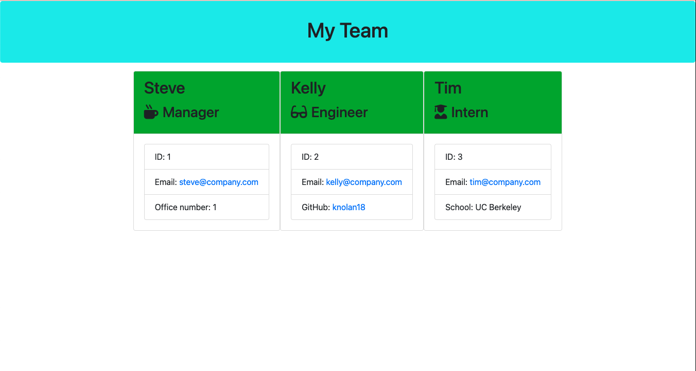

## Team Profile Generator

In this assignment, an application that allows the user to generate a webpage that displays information about a team's employees was created. Using the command-line, the user is able to input information when prompted that will create profiles for employees, including managers, engineers, and interns. All employee profiles will include a name, id number, and an email address. The manager's profile will include an office number, the engineer's profile will include a link to their GitHub page, and the intern's profile will include the name of the school they attended. This information is then used to generate a webpage that displays these profiles as cards.

## Completed Assignment

This image shows the completed assignment's appearance, and functionality:

## Link to Deployed Site

https://knolan18.github.io/10-team-profile-generator/

## Link to Screencastify Walkthrough Video

https://watch.screencastify.com/v/EoXwUh7W5qkZuA9pSkiG